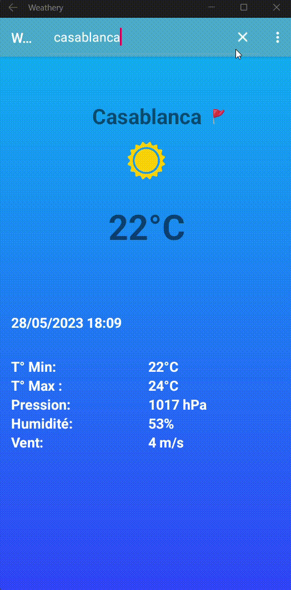

# Weathery
Android Native Weather Application

This Android application utilizes the OpenWeatherMap API and Google Maps service to provide weather information and location services. Users can view the current weather conditions and forecast for a specified location, as well as visualize the location on a map.

## Démonstration 

## Features

- Retrieve current weather data (temperature, humidity, wind speed, etc.) for a given location using the OpenWeatherMap API.
- Utilize the Google Maps service to provide location-based services and visualization.
- Allow users to search for a specific location and retrieve weather information accordingly.
- Display the location on a map using the Google Maps API.

## Requirements

- Android device or emulator running Android 7.0 (API level 31) or above.
- Internet connection to fetch weather data and maps.
- OpenWeatherMap API key. (Sign up at https://openweathermap.org/ to obtain the API key.)
- Google Maps API key. (Get an API key from the Google Cloud Platform Console.)

## Installation

1. Clone or download the repository: `git clone https://github.com/abderrazzaq-laanaoui/Weathery`
2. Open the project in Android Studio.
3. Replace the `YOUR_OPENWEATHERMAP_API_KEY` placeholder in the `Constants.java` file with your OpenWeatherMap API key.
4. Replace the `YOUR_GOOGLE_MAPS_API_KEY` placeholder in the `AndroidManifest.xml` file with your Google Maps API key.
5. Build and run the app on your Android device or emulator.

## Usage

1. Launch the app on your Android device.
2. Grant location permissions to the app when prompted.
3. The app will automatically detect your current location and display the weather information.
4. To search for a different location, tap the search icon and enter the desired location.
5. Select the desired location from the search results.
6. The app will fetch and display the weather information and forecast for the selected location.
7. Tap the map icon to view the location on Google Maps.

## Libraries Used

- Retrofit: For making API requests and handling network operations.
- Gson: For parsing JSON responses from the API.
- Picasso: For loading and displaying images from URLs.
- Google Maps API: For displaying maps and location-based services.

## Contributing

Contributions are welcome! If you find any bugs or want to add new features, feel free to submit a pull request.

## License

This project is licensed under the [MIT License](LICENSE).

---
